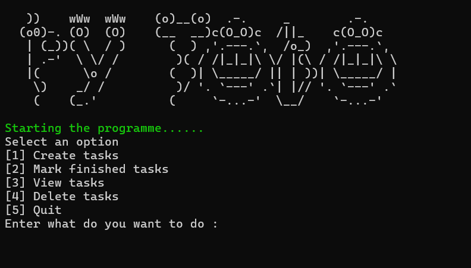
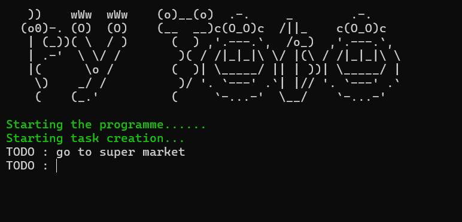
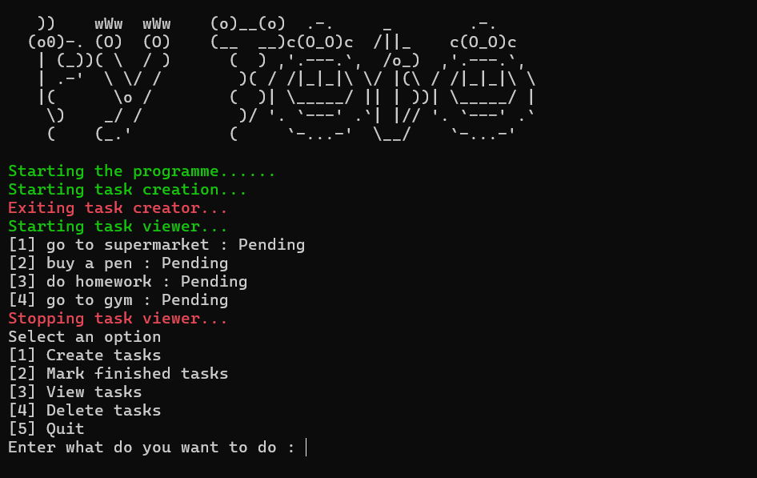
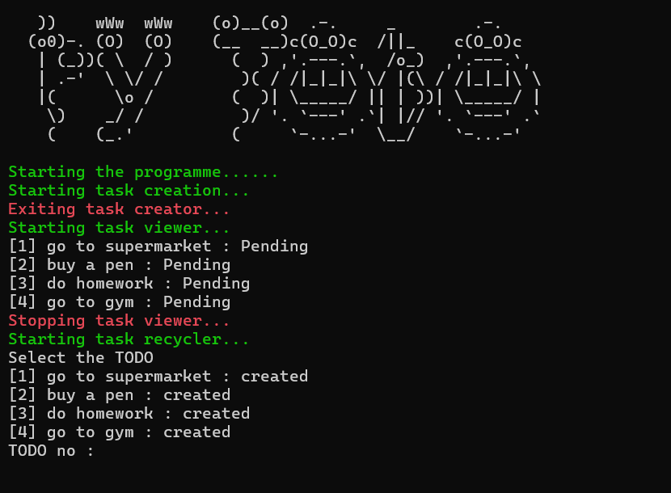
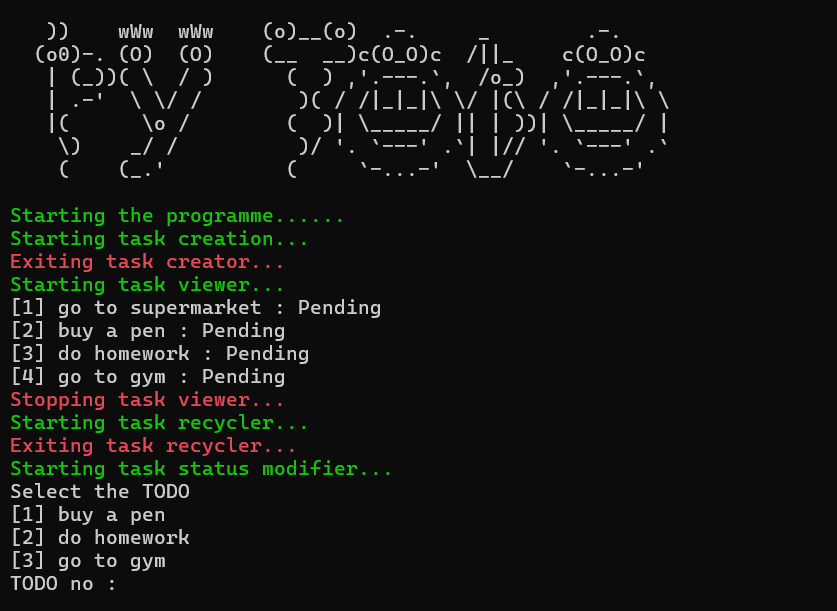
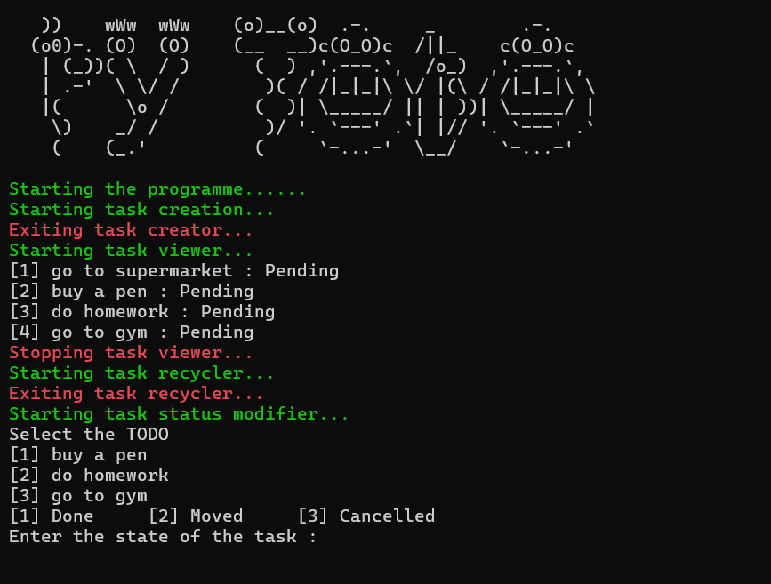

# 📝 CLI To-Do List Manager

A lightweight, interactive Command Line Interface (CLI) application written in Python to manage your daily tasks. It features a clean, auto-refreshing terminal UI, color-coded outputs, and local CSV-based storage to keep track of your daily goals! 🚀







---

## ✨ Features

This program provides a seamless terminal experience with dynamic screen clearing and a simple numbered menu.

*   **➕ Create Tasks:** Easily add new To-Dos for the current day.
*   **✅ Mark Finished Tasks:** Update the status of your tasks. You can mark them as `Done`, `Moved`, or `Cancelled`.
*   **👀 View Tasks:** See a quick overview of today's tasks and their current statuses (Pending, Done, Moved, etc.).
*   **🗑️ Delete Tasks:** Safely remove tasks from your active list. Deleted tasks are automatically backed up to a separate "recycled" file so you never accidentally lose data.
*   **🎨 Clean UI:** Features custom ASCII art, green/red color highlights for actions, and automatic terminal line-clearing for a distraction-free experience.
*   **🛑 Safe Exits:** Gracefully handles `Ctrl+C` (KeyboardInterrupt) so you can safely back out of menus without crashing the program.

---

## 🛠️ Setup & Installation

To run this program, you only need Python installed on your computer. No external libraries are required!

1. **Clone or download the repository** to your local machine.

2. **Run the application:**

```bash
   python main.py
```

*(Note: Use `python3 main.py` on macOS/Linux if required).*

---

## 🎮 How to Use

When you start the program, you will be greeted with a menu:

```text
Select an option
[1] Create tasks
[2] Mark finished tasks
[3] View tasks
[4] Delete tasks
[5] Quit
```

Simply type the **number** of the action you want to perform and press `Enter`.

* **Creating:** Type your task and press Enter. Press `Ctrl+C` when you are done adding tasks to return to the main menu.
* **Modifying/Deleting:** The program will show you a list of available tasks. Type the ID number of the task you want to change, then follow the prompts.

---

## 📁 How Data is Stored (CSV Format)

To keep things simple and portable, this app uses standard **CSV (Comma-Separated Values)** files to store your tasks. All data is saved inside the `lists/` directory.

### File Naming Convention

Files are generated automatically based on the current date:

* **Active Tasks:** `lists/YYYY-MM-DD.csv` (e.g., `2026-09-21.csv`)
* **Deleted Tasks:** `lists/YYYY-MM-DD_del.csv` (e.g., `2026-09-21_del.csv`)

### Data Structure

The CSV files dynamically expand as you interact with your tasks:

1. **When a task is newly created**, it is saved with 3 columns:
> `[Creation Time] , [Task Description] , ["created"]`
> *Example:* `10:47:41, Buy groceries, created`


2. **When a task status is modified**, the script appends 2 additional columns (Time of modification and the new State):
> `[Creation Time] , [Task Description] , ["created"] , [Modified Time] , [State]`
> *Example:* `10:47:41, Buy groceries, created, 11:30:15, Done`


### 🙈 Privacy & Version Control

The repository includes a `.gitignore` file that specifically ignores the `/lists/` directory. This ensures that when you commit or push your code to GitHub, your personal daily tasks and to-do lists remain entirely private on your local machine!
